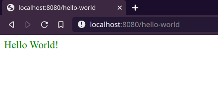
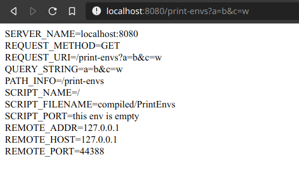

# Web development with Oberon based on CGI scripts

This example shows only a demonstration for Linux x64.

## Requirements

- A system working on Linux x64
- Go compiler
- C toolchain

## Demo

0. Clone this repository

```
git clone https://github.com/egorsmkv/oberon-cgi.git
cd oberon-cgi
```

1. Clone Ofront+ and re-build the translator

```
git clone https://github.com/Oleg-N-Cher/OfrontPlus.git
cd OfrontPlus
git checkout 21a72d80aee3b0caac60a5f2d27566cde2404d01
cd ./Target/Linux_amd64/Bin
export OBERON=.:../Lib/Sym:../Sym
./build
cd ../../../../
```

2. Set environment variables

```
export OBERON=./OfrontPlus/Target/Linux_amd64/Bin:./OfrontPlus/Target/Linux_amd64/Bin/../Lib/Sym:./OfrontPlus/Target/Linux_amd64/Bin/../Sym
export LIB="-I./OfrontPlus/Target/Linux_amd64/Lib/Obj -I./OfrontPlus/Mod/Lib -L./OfrontPlus/Target/Linux_amd64/Lib -lOfront"
export CC="cc -m64 -Os -g0 -fvisibility=hidden -fomit-frame-pointer -finline-small-functions -fno-exceptions -fno-unwind-tables -fno-asynchronous-unwind-tables -Wl,--gc-sections"
```

3. Translate the Oberon program to C

```
./OfrontPlus/Target/Linux_amd64/ofront+ -mC -88 ./examples/HelloWorld.cp
```

4. Compile a "HelloWorld" program

```
mkdir compiled
$CC HelloWorld.c -s -o compiled/HelloWorld $LIB
```

5. Compile in **a new terminal** the HTTP/CGI server and start it

```
go build -o server main.go

./server
```

6. Now you can go to your browser and type this address: http://localhost:8080/hello-world

You will see the same page:



Also, this is an example of printing of environment variables that your CGI application can use:


